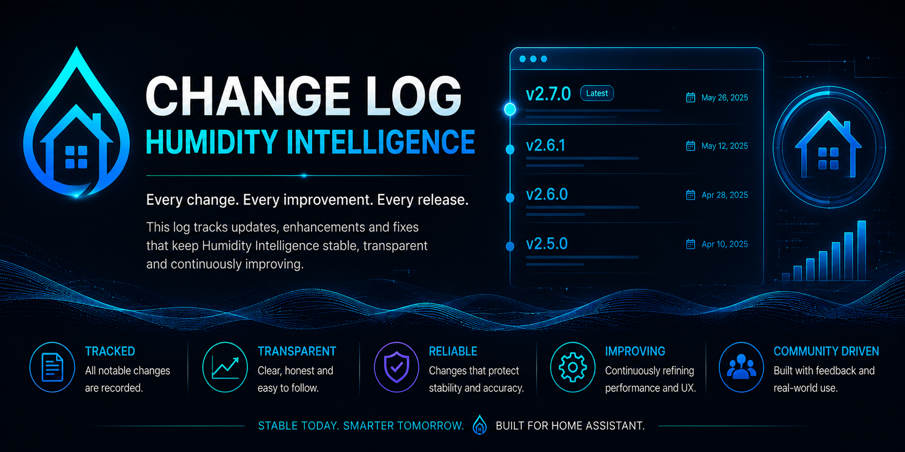

# Changelog

All notable changes to Humidity Intelligence will be documented in this file.

This project follows a practical changelog format for Home Assistant and HACS users. Add new entries under a fresh `Unreleased` section before publishing a future release.

## Unreleased

- Moved working-branch integration metadata to `2.0.9-beta.1` and extended the
  backward-compatible `v205_release_check` manifest contract through the v2.0.9
  beta/rc/stable line. The latest published stable release remains v2.0.8.
- Removed the HACS `country` metadata so Humidity Intelligence can be listed
  globally instead of being limited to the GB store scope.
- Restricted custom filenames for `dump_diagnostics` and `v205_release_check` to
  the exact lowercase `humidity_intelligence_*.json` namespace so those report
  writers cannot overwrite unrelated basename files in the Home Assistant config
  folder. Defaults are unchanged. Automations or scripts using another custom
  report filename must be updated, and Home Assistant must be fully restarted after
  installing the package update; a config-entry reload alone is insufficient.
- Moved caller-selectable diagnostics and release-check reports into the owned
  `<config>/humidity_intelligence/exports/` directory with descriptor-relative
  no-follow directory creation, same-directory atomic replacement, and no config-root
  fallback. Existing config-root reports are retained without automatic migration.
  Report consumers must update their full path. Concurrent writes are serialized and
  the last atomic replacement wins. Entry-scoped purge does not delete export reports;
  only unscoped all-entry purge may remove the exact default diagnostics export,
  while release-check and custom reports remain retained.
- Completed the runtime-owned artifact namespace: the fixed entity-bearing
  `self_check` report now uses the secure report writer at
  `<config>/humidity_intelligence/exports/humidity_intelligence_self_check.json`,
  while generated `dump_cards`, `view_cards`, setup/options, and release-test card
  YAML now writes under `<config>/humidity_intelligence/ui/`. Startup refresh remains
  cache-only. Existing root
  JSON/YAML is retained without copy, dual-write, symlink, move, or automatic
  deletion; consumers must update paths after verifying fresh owned-directory output.
- Added descriptor-relative, no-follow, same-directory atomic YAML replacement with
  directory/file identity revalidation and no config-root fallback. External
  `self_check`, `dump_cards`, and `view_cards` calls now require authenticated admin
  context before work begins; trusted integration-owned UI regeneration calls the
  internal exporter directly. Adding a second entry re-exports all loaded entries
  with qualified card names; removing back to one re-exports the remaining entry
  with unqualified names while retaining the remaining entry's superseded qualified
  files for exact purge.
- Narrowed cleanup to exact owned artifacts. Entry-scoped purge may remove the
  selected entry's default and release-test card exports plus its registered
  dashboard, but no reports. Unscoped all-entry purge may also remove the fixed
  default diagnostics and self-check reports. Config-entry removal separately owns
  only the removed entry's exact default/release-test card exports and registered
  dashboard. Custom card/report names, release-check reports, remaining-entry
  superseded qualified files, and legacy root artifacts remain retained.
- Required authenticated admin user context for every `dump_diagnostics` and
  `v205_release_check` call. Non-admin, unknown-user, and contextless background
  callers are rejected before report lookup, cache work, path resolution, writes, or
  notifications. Direct authenticated admin UI/API calls remain supported.
- Required admin user context for targeted and all-entry `pause_control` /
  `resume_control` calls, explicit `create_dashboard`, and `purge_files`. Existing
  background automations/scripts whose action context has no `user_id` can no longer
  invoke those mutation services, even when configured by an admin. Use an
  authenticated admin UI or API session; any future automated trusted route requires
  separate design approval. First-run dashboard creation remains available through
  the trusted config-entry setup path.
- Made `purge_files` validate its complete fixed set of direct HI-generated file and
  configured-dashboard targets before mutation, publish the exact existing target
  preview with a blocking notification, reject unsafe/non-regular filesystem
  candidates, and report file or dashboard deletion failures as an incomplete purge.
- Escaped dynamic room, target-profile, condensation, and mould text in the V1 Mobile
  source and gallery templates. V1 Mobile remains exportable through v2.0.9 but is
  deprecated for new dashboards in favor of V2 Mobile; removal is deferred to a
  separate v2.1 migration proposal. Existing pasted V1 cards must be re-exported and
  re-copied to receive the escaping fix.
- Redacted private Home Assistant URLs and hosts, local network addresses, bearer
  credentials and tokens, device IDs, local user paths, and Home Assistant entity IDs from
  locally generated issue-triage body summaries before Markdown/HTML escaping.
  Public issue links remain available for maintainer triage.

## 2.0.8 - 2026-07-05

- Declared Home Assistant `2026.5.1` as the minimum HACS install/update
  compatibility floor and surfaced the requirement in installation guidance.
- Migrated computed humidity, target, drift, and delta sensor percentage units from
  the deprecated Home Assistant `PERCENTAGE` unit constant to
  `UnitOfRatio.PERCENTAGE` for Home Assistant Core `2026.7` compatibility, with a
  legacy `%` fallback for older supported Core versions. Entity IDs, values, lane
  ordering, services, diagnostics semantics, and generated-card display behavior are
  unchanged.

- Added a first-run welcome page before Frontend Dependencies that explains the
  staged setup method, with README guidance and telemetry copy updated so users
  can safely save a small initial sensor set and return through Options later.
- Fixed Temperature Slope setup/options submission so collapsed Advanced source
  lists that submit empty fall back to the configured temperature sensors instead
  of re-rendering the same form with a hidden validation error.
- Added Home Assistant Area/Label setup assistance for telemetry configuration:
  HI can use registry metadata to suggest room/level defaults and diagnostics
  mismatch counts, while saving only explicit HI telemetry fields. Areas and Labels
  are advisory only and do not affect lane ordering, entity semantics, generated-card
  truth, output control, or migration behavior.
- Blocked default generated V2 dashboard YAML from shipping runtime mutation controls:
  pause/resume and the standalone View Cards service button are now
  read-only/default-safe surfaces. The System and Manual buttons keep the
  v2.0.7 tap-to-toggle helper behavior, and the output details expander keeps
  the v2.0.7 UI-only helper toggle so the bottom Outputs section still opens
  from the card. Backend services remain available through Home Assistant
  service/admin workflows.
- Replaced the generated V2 Pause LIVE tile with a passive compact
  gauge-style Stability preview badge. The badge reads future v2.1 Stability
  Score diagnostics from the existing HI diagnostics sensor when present,
  otherwise it degrades without calculating scores, requiring a new sensor, or
  creating a control path. Current/complete Stability shimmer is paced at 10 beats
  per minute with a 6 second animation cycle.
- Hardened the Stability preview fallback so null or empty future score values stay
  in the default future/preview state instead of rendering as a real score of zero,
  and aligned the tablet/gallery System and Manual card glow with the mobile layout.
- Made Home Assistant setup-assist suggestions an explicit telemetry form preview
  action so advisory Area/Label-derived defaults are reachable without changing the
  normal save path.
- Kept global pause/resume support, but global all-entry pause/resume calls now
  require an admin user context. Per-entry calls remain scoped to the supplied
  config entry.
- Hardened release hygiene and support output handling: the tracked secret scan now
  fails closed when no tracked files are selected, issue-triage reports are written
  through a confined private atomic writer, and diagnostics/support exports favor
  sanitized structure/count/status summaries and redaction. `self_check` and
  release-validation reports may still include configured/generated entity IDs needed
  to debug missing mappings, so treat those exports as local/private until reviewed or
  sanitized before public sharing.
- Expanded issue-triage public-safety checks to reject macOS, Linux, and Windows
  local absolute paths, and bucketed mapped runtime entity state in native diagnostics
  into privacy-safe availability categories instead of exposing raw Home Assistant
  state text.
- Extended the existing `v205_release_check` manifest-version contract to accept
  the v2.0.8 beta/rc/stable line while preserving the backward-compatible service
  name.
- Release-candidate preparation impact: manifest metadata is stable `2.0.8`, while
  GitHub release publication, tagging, branch promotion, and the user-facing package
  record stay with the normal maintainer approval flow.
- Runtime impact: deterministic lane ordering, output-writer boundaries, entity
  semantics, and migration shape stay aligned with the existing backend contract.
  Generated dashboards should be refreshed or re-exported after update when users rely
  on default V2 cards or pasted Manual-card YAML.

## 2.0.7

- Promoted integration metadata to stable `2.0.7`.
- Added a GitHub Pages SEO landing site for search discovery, with static public
  copy, the Humidity Intelligence logo, wide home-telemetry hero artwork,
  sitemap/robots crawl helpers, structured search metadata, pinned Pages workflow
  actions, README routing, and repository source-of-truth boundaries. Runtime
  behavior, entity semantics, generated dashboards, HACS metadata, and migration
  requirements are unchanged.
- Documented HA Lab as advisory Operational Beta Validation Infrastructure and added
  PR/release-governance wording for reporting sanitized HA Lab evidence without
  changing runtime, UI, entity semantics, migration, or release authority.
- Hardened visual-alert service validation, diagnostics credential-key redaction,
  generated V2 card HTML rendering, and local issue-triage report escaping without
  changing deterministic lane ordering, entity semantics, or migration behavior.
- Fixed PM2.5 aggregate runtime truth by ensuring new PM2.5 aggregate sensors use canonical PM25 entity slugs and by normalizing existing HI PM2.5 aggregate entity IDs from `pm2_5` to `pm25` during setup.
- Hardened generated-card AQ output details so unresolved optional AQ aggregate rows
  are pruned instead of rendering stale `Entity not found` rows, and added
  generated-card entity reference availability checks to `self_check` and
  `v205_release_check`.
- Expanded generated-card entity reference checks so stale IDs embedded inside
  generated-card JavaScript/string expressions are reported, not only YAML `entity:`
  rows.
- Filtered generated-card release-validation extraction so JavaScript service names,
  predicate prefixes, object properties, and entity-prefix strings no longer fail
  generated-card entity availability checks.
- Recorded HA Lab advisory validation for commit `55dc2b9`: lab identity, HI
  presence/diagnostics, scenario-matrix read-only baseline, and Stage 3 six-sensor
  runtime-readiness checks passed after lab-only deploy and manual restart, without
  stable-instance access, service calls, helper mutation, dashboard mutation,
  restart, reload, or output writes by Codex.
- Added diagnostics, `self_check`, and `v205_release_check` reporting for PM2.5
  aggregate entity-ID normalization conflicts when a canonical `pm25` target entity
  already exists.
- Sanitized generated V2 card templates, gallery exports, and test fixtures so
  public artifacts use canonical HI placeholders instead of maintainer-local
  presence, alarm, tracker, or room-sensor entity IDs.
- Refined generated V2 Current Air Control cards so degraded or unmapped alert
  candidates no longer occupy primary chip-row space; no-automation context remains
  visible in reason text.
- Fixed generated V2 Current Air Control cards so missing or unavailable
  `sensor.air_control_mode` no longer falls back to `normal` / `READY`; backend
  `telemetry_unavailable` now renders as explicit degraded UI truth ahead of stale
  helper-derived alert or AQ display state.
- Kept startup UI refresh option semantics deterministic by removing the
  unconditional startup `dump_cards` task; startup now follows the configured
  `auto_refresh_ui_on_startup` refresh path, while explicit UI install,
  option-visibility changes, and manual `dump_cards` still write card files.
- Added Configuration Walkthrough links to setup Frontend Dependencies, post-configuration Frontend Dependencies, and final UI export guidance.
- Added GitHub Wiki support-manual routing from the README, including configuration, services, diagnostics, generated dashboard, HACS/update, AQ/CO safety, troubleshooting, and release-validation guidance.
- Added release/PR checklist support for recording Wiki update status as `updated`, `no-op`, or `blocked` when public manual guidance is affected.
- Added a Wiki Services Reference, footer navigation across public Wiki content pages, and a Wiki banner asset for a clearer support-manual experience.
- Declared native Home Assistant diagnostics as an integration after-dependency so hassfest accepts the diagnostics support surface without changing runtime control behavior.
- Changed generated V2 Current Air Control cards so red control-row styling follows selected alert/CO runtime truth, while degraded or unmapped alert candidates remain in reason text instead of command-state red.
- Moved optional Level 1 / Level 2 display-label editing into setup Zones and post-configuration Zone Options before Zone 1 / Zone 2 editing; labels are sanitized, fallback to `Level 1` / `Level 2`, and affect generated-card/config-flow/support display text only.
- Migration note: users with manually referenced PM2.5 aggregate entity IDs using `pm2_5` should update those references to `pm25` after restart; generated cards should be regenerated/re-copied when PM2.5 aggregate surfaces are used.

## 2.0.6

- Promoted integration metadata to stable `2.0.6`.
- Added a degraded `telemetry_unavailable` runtime mode when required humidity or configured temperature telemetry is unavailable, standing down lower-priority control lanes instead of reporting a normal/all-clear state.
- Fixed global gate preemption so an active humidity-danger alert lane clears its active alert switch, held alert context, and Current Air Control alert chip when the gate takes authority.
- No migration is required for the global gate preemption fix; after updating HI, reload/restart Home Assistant, then run `humidity_intelligence.dump_cards` or re-copy any pasted dashboard YAML and refresh dashboard/browser cache to see the Current Air Control card update.
- Fixed CO emergency clearing so HI schedules a recheck at the two-minute clear deadline instead of waiting for the next normal control interval.
- Added direct backend simulation validation for `HI Air Control Mode` and `HI Air Control Reason`, covering normal, telemetry unavailable, zone, AQ, gate, and opt-in CO pressure scenarios without adding runtime fake telemetry paths.
- Fixed setup/options telemetry add and edit pages so users can cancel back to the previous telemetry page without losing already-saved flow data, with explicit close-without-saving confirmation on HI-controlled Cancel actions.
- Fixed Zone 2 setup/options defaults and trigger labels so Zone 2 trigger ownership is shown and stored as Zone 2 / Level 2 unless explicitly changed.
- Added explicit local HI-only snapshot services for advanced maintenance: `create_local_backup` and `list_saved_versions`.
- Exposed compact local snapshot status through diagnostics, self-check, and optional release-check freshness inputs.
- Kept local snapshot support manual and package-local only; no restore flow, automatic rollback, HACS interception, startup snapshotting, or whole-instance backup behavior is included.
- Added a Community Ideas & Proposals issue form for ideas, dashboard suggestions, compatibility requests, documentation improvements, diagnostics/support-flow ideas, and automation/control suggestions.
- Updated contributor, support, and report-only triage wording so community ideas remain manual intake signals, not implementation authority.
- Added clean-install setup/repair guidance for the `HI House Humidity Drift 7d` Statistics helper dependency.
- Added a non-blocking Home Assistant Repairs issue only when `sensor.house_humidity_mean_7d` is missing.
- Differentiated missing helper, helper not ready or unavailable, non-numeric helper, low history coverage, and invalid source states without fabricating drift values.
- Refined optional Current Air Control temperature chip colours to use backend-owned seasonal cold, comfort, warm, and hot boundaries.
- Retuned Spring and Summer temperature chip comfort/warm bands while keeping the backend-owned seasonal boundary model unchanged.
- Exposed the resolved temperature warm boundary through comfort sensor attributes and diagnostics so generated cards read seasonal thresholds from backend truth.
- Kept setup/options Frontend Dependencies pages frontend-only; drift dependency truth remains available through diagnostics, self-check, release-check, drift sensor attributes, and Repairs.
- Preserved the existing drift calculation and legacy `sensor.house_humidity_mean_7d` compatibility.
- Kept lane ordering, AQ, humidifier, alert, output, migration, restore, HACS update, and runtime-control behavior unchanged except for the explicit `telemetry_unavailable` mode/entity truth correction.

## 2.0.5

- Reorganised setup and options so essentials stay visible while tuning controls move behind Advanced sections.
- Changed Advanced tuning from submit-gated reveal toggles to in-form collapsible sections so tuning controls open and retract immediately without changing saved runtime behavior.
- Added recommended-default guidance across setup/options without changing deterministic runtime behavior.
- Added `show_output_entity_details` as a UI-only generated-card option; new installs default to the cleaner V2 output display unless it is enabled.
- Made `Thresholds & Comfort` easier to scan by keeping comfort mode visible and moving custom comfort/threshold tuning into Advanced.
- Changed first-install UI export default to `v2_tablet`.
- Kept custom humidity target bounds behind Advanced in post-configuration Global Gates and reviewed setup/options parity for the v2.0.5 UX flow.
- Preserved canonical `dump_cards` behavior: unscoped exports all cached/generated layouts; scoped `layout` exports only the specified layout.
- Preserved deterministic runtime lane ordering, alert hierarchy, CO emergency behavior, humidifier independence, and public entity semantics.
- Added `v205_release_check`, a read-only Home Assistant service for test-repo validation of the v2.0.5 generated-card and `dump_cards` contracts.
- Changed setup/options dependency display, `self_check`, `v205_release_check`, and `dump_diagnostics` frontend dependency reporting to use the same Lovelace resource inspection path via `LOVELACE_DATA.resources.async_items()`, returning detected URLs or a non-blocking `not_inspectable` status instead of legacy false negatives.
- Added native Home Assistant diagnostics for Humidity Intelligence config entries so users can download a redacted support file for GitHub issues.
- Updated issue templates and local issue triage to prefer attached native Home Assistant diagnostics, suggest `has-diagnostics` when present, and suggest `needs-bundle` for bug/support reports without one.
- Hardened `HI House Humidity Drift 7d` so missing or unavailable `sensor.house_humidity_mean_7d` statistics dependency is reported in sensor attributes, `self_check`, `v205_release_check`, and diagnostics instead of failing silently.
- Fixed calculated room temperature slope sensors so they publish a seeded state immediately after setup instead of waiting for a later source update, preventing restored-but-unavailable slope chips after HI restarts.
- Fixed calculated temperature slope diagnostics mapping so every configured slope source prefers Home Assistant's registered entity id when it differs from the predicted `sensor.hi_*` fallback.
- Promoted integration metadata to stable `2.0.5`; branch/version governance now allows beta, rc, or stable labels on `senyo888-patch-1`, rc or stable labels on `develop`, and stable releases on `main`.

## 2.0.4

- Fixed alert flash color payloads so internally triggered visual alerts send RGB lists accepted by Home Assistant service validation.
- Added user-friendly headers to V2 card YAML exports with Manual-card paste instructions, `dump_cards` refresh guidance, and frontend dependency reminders.
- Fixed alert flash payloads so optional visual-indicator power entities are omitted when unset, avoiding schema errors and repeated debug logs.
- Refined Air Control UI chips so AQ and humidity rows use House, Upstairs, Downstairs ordering and removed the Kitchen temperature-slope chip from the humidity row.
- Refined Air Control humidity chips to use configured zone-room humidity telemetry, skip legacy bespoke delta chips, and list room humidity deltas alphabetically.
- Added an optional Air Control temperature chip row controlled from Temperature Slope settings, showing house/level temperatures, configured zone-room temperatures, and room temperature slopes.
- Added automatic/custom temperature comfort configuration with runtime comfort sensors used by V2 temperature chip colours.
- Expanded post-configuration zone editing so humidity high, air quality, condensation risk, and mould risk thresholds remain editable per zone.
- Fixed calculated temperature slope chip fallback to use Home Assistant slug-compatible generated slope entity IDs and configured slope source checks.
- Renamed user-facing dependency wording to Frontend Dependencies across setup, options, services, self-check output, and docs.
- Added README v2.0.4 upgrade guidance to run `humidity_intelligence.dump_cards` and paste the generated YAML into existing Manual dashboard cards for UI changes.
- Enlarged the HI icon/logo artwork within the required 256x256 canvas so it appears larger in Home Assistant and HACS surfaces.
- Clarified Global Gates target-profile labels as `Humidity Intelligence target profile mode` and `Humidity custom target`, and added explicit alert visual rule removal in setup and options flows.
- Simplified alert chipsets so they render only the alert lane/status chip and the resolved alert source/context chip.
- Changed humidity/mould/condensation visual alerts to flash 10 times, restore prior light state, wait 30 minutes, and repeat only while the same alert remains active.
- Expanded diagnostics with target profile mode, active profile/season/custom target, zone/alert mappings, visual alert config, active alert resolution, unavailable entities, and warnings.
- Reduced live `HI Diagnostics` state attributes to a compact recorder-safe summary; full diagnostics remain available from `dump_diagnostics`.
- Fixed alert helper switch churn so active alerts no longer flip their UI helper switches off/on during every evaluation cycle.
- Added single-flight automation evaluation and stopped internal status helper switches from retriggering evaluation, preventing alert-clear dogpiles when humidity returns to normal.
- Fixed startup UI refresh scheduling to use Home Assistant's thread-safe task creator, preventing unsafe `hass.async_create_task` calls during startup.
- Fixed startup UI refresh cleanup so Home Assistant builds where `hass.create_task` returns no task handle do not raise during the startup event.
- Removed custom trigger entities and custom binary sensor alert configuration so alerts remain internally calculated from HI telemetry, risk logic, and room/zone resolution; legacy custom alert rows are stripped from config-flow saves.
- Removed CO output-device selection from the main alert flow; CO Emergency now uses configured CO telemetry and existing configured ventilation outputs.
- Added clearer zone boost guidance and warnings when boost levels are not higher than normal zone fan levels.
- Added an alert handling setting for internally calculated humidity, mould, and condensation alert handling while keeping CO Emergency independent.
- Fixed alert boost hold behavior so selected alert zone outputs are not returned to auto while the alert lane is active.
- Changed alert conflict handling to keep the current actionable alert boost until that originating alert clears, unless a higher-priority alert appears.
- Changed unmapped/degraded alert handling so unsafe alert candidates are reported in the reason text while automation continues to the next eligible priority.
- Fixed built-in humidity, mould, and condensation alert candidates so they enter the alert lane, resolve to the mapped zone boost level, and populate `HI Active Alert Context` even when no matching explicit alert row is configured.
- Fixed V2 alert chip detection so generated cards recognise real alert switch entity IDs and the active alert context companion chip.
- Changed Humidity Danger alerts to use the active target profile high-risk threshold instead of any saved static humidity threshold.
- Updated alert metadata/reason text so Humidity Danger reports its active profile threshold source while CO Emergency keeps its configured ppm threshold.
- Fixed CO emergency evaluation so it remains the absolute top-priority lane before gates, pause, manual override, and normal control locks.
- Added GitHub community health files, issue forms, validation workflows, and contributor guidance.
- Added CI SAST/security checks, Bandit configuration, broader diagnostics redaction, and cleanup error logging.
- Added Hassfest validation workflow for Home Assistant custom integration checks.
- Updated Hassfest compatibility by staging the root-content HACS layout as `custom_components/humidity_intelligence`, aligning manifest keys, shared flow errors, and Lovelace after-dependency metadata.
- Added pre-Hassfest staged metadata normalization and verification so CI validates the generated custom component tree, not stale root metadata.
- Added a V2 UI Gallery with default mobile, tablet, and legacy mobile examples plus contributor/reference documentation.

Previous Releases

## 2.0.3

- Previous documented release.

