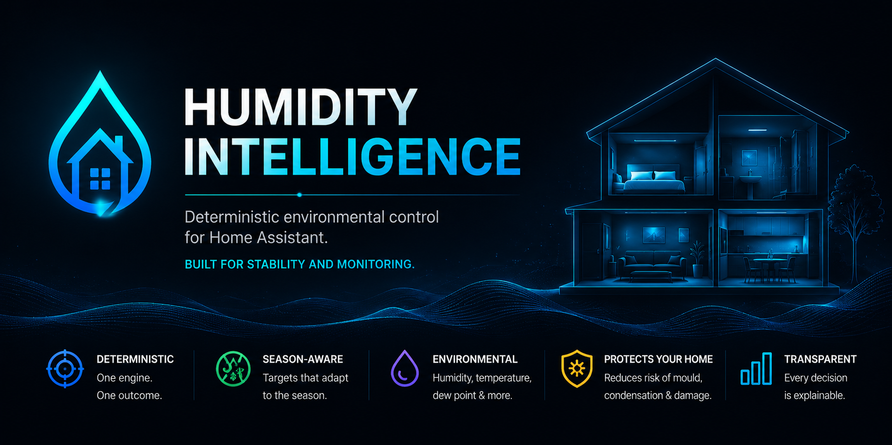

# Contributing to Humidity Intelligence

Thanks for helping improve Humidity Intelligence. This repository is maintained as a Home Assistant custom integration intended for HACS users, so changes should preserve a clear integration layout, predictable behavior, and safe public examples.

## Branches and pull requests

Open pull requests against `develop`. The `main` branch is reserved for stable release history unless the maintainer says otherwise.

Before opening a PR:

- Install or update the integration in a Home Assistant test instance.
- Restart Home Assistant and confirm the integration loads cleanly.
- Check Home Assistant logs for new warnings or errors.
- Run `scripts/security/scan_secrets.sh` before pushing if Gitleaks is installed locally. The default mode scans tracked files and avoids ignored local credential files.
- Validate the config flow when setup behavior changes.
- Run `humidity_intelligence.refresh_ui` when dashboard output or generated UI changes.
- Update documentation when behavior, setup steps, services, or UI examples change.

## HACS custom integration context

Humidity Intelligence is a structured Home Assistant custom integration. Its tracked
installable package lives under `custom_components/humidity_intelligence/`, the
conventional HACS integration layout. HACS, Hassfest, and repository validation inspect
that tracked package directly; repository-only docs, tests, scripts, site files, legacy
material, and Gallery examples stay outside the installed payload.

Do not add unrelated integrations to this repository. Keep `hacs.json`,
`custom_components/humidity_intelligence/manifest.json`, README installation guidance,
release notes, and CI packaging assumptions aligned with the current release layout.

## UI Gallery submissions

Reusable dashboard examples should live under:

```text
/ui-gallery/<card-id>/
```

Each Gallery submission should include:

- `README.md`
- `card.yaml` or `dashboard.yaml`
- `preview.png`

Use [ui-gallery/CONTRIBUTING.md](ui-gallery/CONTRIBUTING.md) and [ui-gallery/reference.txt](ui-gallery/reference.txt) for the required gallery format.

Gallery examples must preserve canonical Humidity Intelligence backend entities/helpers. Do not publish private entity IDs, secrets, addresses, personal data, or screenshots that reveal sensitive home information. Add or update the matching entry in [ui-gallery/README.md](ui-gallery/README.md) when adding a gallery example.

## Privacy and redaction

Before submitting an issue, PR, YAML file, screenshot, or log excerpt, remove:

- Private entity IDs
- Home Assistant tokens
- API keys
- Internal URLs
- Home addresses
- Device IDs
- Personal names or other personal data

Use generic examples such as `sensor.redacted_bedroom_humidity` when needed.

Secret-scanner findings must stay redacted in logs, reports, pull requests, and issue
text. Do not add broad allowlists for docs, reports, YAML, examples, fixtures, tests,
or local `.codex/` material. If a finding is a proven false positive, keep any
allowlist narrow and document why it is safe.

## Coding style

Humidity Intelligence favors deterministic environmental-control logic. Contributions should keep behavior predictable and explainable:

- Prefer explicit decision paths over implicit side effects.
- Preserve reason telemetry so users can understand why a state or action was selected.
- Use safe fallbacks when entities are unavailable or optional configuration is missing.
- Keep runtime behavior stable across Home Assistant restarts.
- Avoid changing dashboard logic or backend semantics as part of unrelated maintenance.

## Documentation expectations

Update `README.md`, docs, services documentation, or UI Gallery README files whenever a change affects setup, entities, services, generated UI, release behavior, or HACS installation. Documentation should be practical, current, and safe to publish.

## Bug reports, ideas, and review process

Use the GitHub issue forms for bugs, feature requests, community ideas/proposals, configuration help, and UI Gallery submissions. For bug/configuration reports, attach the native Home Assistant diagnostics file for Humidity Intelligence when possible. If diagnostics cannot be downloaded, include the Humidity Intelligence version, Home Assistant version, install method, logs, expected behavior, actual behavior, checks already tried, and steps to reproduce.

Use the Community Ideas & Proposals form for wider ideas, dashboard suggestions, compatibility requests, documentation improvements, and automation/control suggestions that need maintainer review before implementation. These issues are intake signals only: reactions and comments may inform visibility, while implementation, release scope, runtime behavior changes, and Home Assistant changes stay with maintainer review. A community idea becomes a formal HI proposal when maintainers decide it is worth taking forward.

Maintainers can use the report-only triage helper documented in [docs/issue-triage.md](docs/issue-triage.md) to review new, untriaged, or recently updated issues without mutating GitHub issue state.

Pull requests are reviewed for correctness, Home Assistant compatibility, HACS readiness, privacy safety, and documentation quality. The maintainer may ask for a smaller scope, additional testing, or clearer docs before merging.
