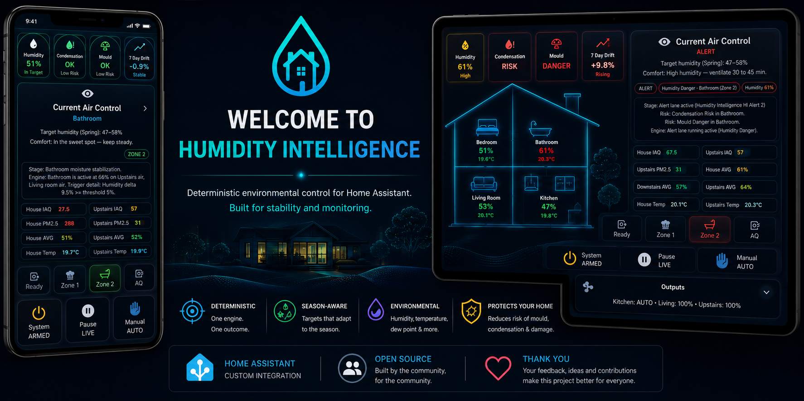
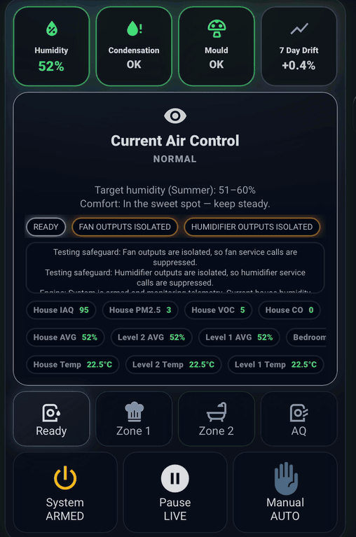

<!-- Logo and Banner -->



# Humidity Intelligence

## Domestic Environmental Stabilisation Engine for Home Assistant

[](https://github.com/senyo888/Humidity-Intelligence/releases)
[](https://hacs.xyz)
[](manifest.json)
[](LICENSE)
[](https://github.com/sponsors/senyo888)

## Contents

- [TL;DR](#tldr)
- [What Is Humidity Intelligence](#what-is-humidity-intelligence)
- [V2 UI Example](#v2-ui-example)
- [Support Humidity Intelligence](#support-humidity-intelligence)
- [Why Environmental Stability Matters](#why-environmental-stability-matters)
- [Air Quality and Environmental Stability](#air-quality-and-environmental-stability)
- [Season-Aware Environmental Control](#season-aware-environmental-control)
- [Design Philosophy](#design-philosophy)
- [Architecture Overview](#architecture-overview)
- [Public Architecture Contract](#public-architecture-contract)
- [Current Release Highlights](#current-release-highlights)
- [Installation](#installation)
- [Frontend Dependencies](#frontend-dependencies)
- [Migration Guide - v1 to v2](#migration-guide---v1-to-v2)
- [Full Configuration Flow](#full-configuration-flow)
- [Configuration Manual](#configuration-manual)
- [UI Gallery](#ui-gallery)
- [Post-Configuration Workflow](#post-configuration-workflow)
- [How to Use Services](#how-to-use-services)
- [Documentation and Support Manual](#documentation-and-support-manual)
- [Support, Diagnostics, and Issue Triage](#support-diagnostics-and-issue-triage)
- [Runtime Simulation Validation](#runtime-simulation-validation)
- [Release Notes](#release-notes)

---

## TL;DR

Humidity Intelligence is a domestic environmental control engine for Home Assistant. It watches the conditions inside a home, decides which environmental problem needs attention first, and explains that decision in plain Home Assistant entities and dashboard text.

It reads humidity, temperature, air quality, condensation, mould-risk, carbon monoxide (CO), presence, time, pause, and override signals, then resolves **one explainable control decision per evaluation cycle**.

It gives you:

- season-aware humidity targets
- deterministic lane priority
- safe degraded behavior when inputs are missing
- generated Lovelace dashboards backed by runtime truth
- native Home Assistant diagnostics for support and triage
- services for dashboard export, self-check, diagnostics, pause/resume, and release validation

Current release: **v2.0.7-beta.1**.

v2.0.6 remains the current stable release on `main`; v2.0.7-beta.1 is the active staging/testing line.

---

## What Is Humidity Intelligence

Humidity Intelligence is designed to help stabilise the environment inside a home using real sensor telemetry and carefully coordinated smart-home control.

Most Home Assistant dashboards show readings. Humidity Intelligence turns those readings into a single, explainable control decision. It watches humidity, temperature, temperature drift, air quality, condensation risk, mould risk, and seasonal comfort patterns, then uses configured devices to guide the home back toward a more stable state.

Using sensors placed around the property, Humidity Intelligence can intelligently control devices such as:

- air purifiers
- dehumidifiers
- extractor fans
- humidifiers
- ventilation systems
- smart lighting alerts

The system works as a coordinated environmental control layer for everyday household conditions. For example:

- rising bathroom humidity can trigger extractor and ventilation behaviour before condensation settles
- poor air quality from cooking or occupancy can activate configured purification or ventilation zones
- unstable overnight humidity can be corrected gradually to improve comfort and reduce moisture stress
- dangerous conditions such as mould-risk humidity or carbon monoxide escalation can trigger higher-priority safety responses

Humidity Intelligence is intentionally deterministic. Every decision is based on visible telemetry, defined environmental rules, and priority logic rather than opaque AI behaviour or unpredictable automation chains. The goal is not automation for its own sake; it is long-term environmental stability, comfort, and property protection.

The project also places strong emphasis on transparency. Users can see why actions are happening, what environmental conditions triggered them, which zone is active, and what the system is trying to achieve at any given moment. Seasonal context, comfort targets, active alerts, and runtime reasoning are surfaced directly into the UI so the system feels understandable rather than mysterious.

At its core, Humidity Intelligence is about creating a calmer, more stable living environment through continuous environmental awareness and accountable smart-home control.

<details>
<summary><strong>Quick Demo</strong></summary>




</details>

---

## V2 UI Example

<p>
  
</p>

<details>
<summary><strong>More UI Examples</strong></summary>

Additional screenshots and layout comparisons live in the Wiki so the front page stays focused.

- [Browse the UI Gallery](https://github.com/senyo888/humidity-intelligence/wiki/UI-Gallery)
- [Open the canonical gallery source](ui-gallery/README.md)

</details>

---

## Support Humidity Intelligence

### Enjoying Humidity Intelligence?

If you're finding Humidity Intelligence useful, insightful, or just interesting to explore, consider giving the repository a star.

It helps others discover the project, supports ongoing development, and shows that this kind of deterministic, explainable approach to Home Assistant has community value.

[Star Humidity Intelligence on GitHub](https://github.com/senyo888/Humidity-Intelligence)

Optional sponsorship is also available through GitHub Sponsors:

[Support the project on GitHub Sponsors](https://github.com/sponsors/senyo888)

Sponsorship is optional. It does not create a support SLA, private support obligation, feature guarantee, release commitment, or change to Home Assistant / HACS behaviour.

---

## Why Environmental Stability Matters

Homes rarely become damp, dry, stale, or uncomfortable because of one isolated reading. Problems usually build as patterns: a bathroom that stays wet too long, a room that drifts away from the rest of the house, a winter profile that needs a lower humidity target, or an air-quality spike that lingers after cooking.

Humidity Intelligence is built for those patterns. It treats environmental stability as the goal, not a single perfect number.

Instability can appear as:

- drift
- imbalance
- duration
- recurring spread patterns

### High Humidity Related Issues

- condensation formation
- mould growth risk
- dust mite proliferation
- sleep disruption
- structural degradation over time

### Low Humidity Related Issues

- irritated airways
- dry throat and coughing
- worsened asthma symptoms
- dry skin and eye irritation
- reduced respiratory resilience

### Indoor Plant Health Problems

- low humidity: leaf browning, stress, slowed growth
- excess humidity: fungal growth and pest vulnerability

Most homes oscillate between both extremes seasonally.

V2 models that instability directly, then explains what it is seeing instead of hiding the reasoning in disconnected automations.

---

## Air Quality and Environmental Stability

Humidity Intelligence is not only humidity-focused. It contributes to environmental stability by surfacing indoor air-quality signals from configured Home Assistant entities and, where users have configured suitable outputs, using available devices such as air purifiers or ventilation fans to respond to poor air-quality conditions.

Air-quality support is telemetry-driven. Humidity Intelligence reflects configured sensors, entities, thresholds, and output devices; the UI and reason panel stay aligned with backend/entity truth.

The wider air-quality (AQ) telemetry family in the current configuration flow includes indoor air quality (IAQ), fine particulate matter (PM2.5), volatile organic compounds (VOCs), carbon dioxide (CO2), and carbon monoxide (CO), depending on what the user configures.

Where an AQ lane is configured, it remains below safety and moisture-risk alert lanes in the deterministic priority order. Carbon monoxide emergency handling remains the highest-priority runtime lane, while normal AQ responses are deferred when higher-priority alert or zone lanes are active.

Carbon-monoxide safety deserves primary, certified protection. Humidity Intelligence can reflect configured CO telemetry as an additional Home Assistant awareness layer, while certified carbon-monoxide alarms remain the primary detection and alerting system.

Detailed AQ and CO guidance lives in the support manual:

- [Air Quality and CO Safety](https://github.com/senyo888/humidity-intelligence/wiki/Air-Quality-and-CO-Safety)
- [Understanding Control Decisions](https://github.com/senyo888/humidity-intelligence/wiki/Understanding-Control-Decisions)

---

## Season-Aware Environmental Control

`56%` is not always "high."

The same humidity reading can mean different things in January and July. A home that feels stable in summer may be too damp for a cold winter envelope, while an aggressive winter target may be unnecessarily dry in warmer months.

Humidity Intelligence evaluates humidity **relative to the active target profile**:

- Winter defaults to a lower comfort band than summer
- Spring and autumn use intermediate bands
- Custom target profiles are supported when configured

Interpretation now follows target-relative states:

- `below_target` -> dry for the active profile
- `in_target` -> stable band for the active profile
- `above_target` -> elevated for the active profile
- `high_risk` -> materially above the active profile's safe limit

This keeps stability as the primary goal while making evaluation season-correct and explainable.

Temperature comfort uses the same source-of-truth approach for display, so dashboard colours and chips follow backend comfort sensors rather than card-only assumptions:

- Automatic mode resolves the active seasonal comfort band and warm boundary
- Custom mode allows a fixed lower/upper comfort band and derives the warm boundary as custom high + `1.0°C`
- Temperature chips use HI comfort sensors, not card-only thresholds

Default temperature comfort bands:

- Winter: blue below `20°C`, green `20-21°C`, yellow `21-21.5°C`, red above `21.5°C`
- Spring: blue below `20.5°C`, green `20.5-22°C`, yellow `22-23.5°C`, red above `23.5°C`
- Summer: blue below `21°C`, green `21-24°C`, yellow `24-26.5°C`, red above `26.5°C`
- Autumn: blue below `20°C`, green `20-21.5°C`, yellow `21.5-23°C`, red above `23°C`

---

## Design Philosophy

Humidity Intelligence is built around a simple premise: a home should not be regulated by a loose pile of automations competing for control. It should have one visible environmental controller that reads configured telemetry, applies a stable priority hierarchy, and resolves one explainable outcome per evaluation cycle.

The engine is deterministic by design. It avoids guesses and hidden preferences. It evaluates season-aware humidity targets, safety gates, alert conditions, zone demand, air quality state, and humidifier needs through explicit rules so runtime behavior can be inspected, predicted, and explained.

The UI is a truth surface. Current Air Control, chips, diagnostics, and exported cards reflect backend telemetry, entity mappings, runtime mode, and degraded-state reasons. If an input is missing or an output is unavailable, Humidity Intelligence shows that condition and falls back safely without pretending the home is stable.

The architectural preference is calm regulation over automation chaos:

- one selected ventilation lane per evaluation cycle
- CO emergency and alert hierarchy before comfort correction
- humidifier lanes kept independent from ventilation resolution
- global gates and overrides visible when they suppress control
- generated dashboards aligned with backend truth only
- safe degraded behavior before blind output writes

The result should feel steady in a domestic environment: readable, conservative, and accountable when conditions change.

---

## Architecture Overview

Humidity Intelligence operates across three defined layers. Each layer has a clear job: turn readings into meaning, decide which lane has authority, and show the result without inventing extra logic.

### 1) Intelligence Layer - Environmental Physics

This layer turns raw telemetry into structured environmental signals:

- dynamic house average humidity
- 7-day mean and drift tracking, using the canonical `sensor.house_humidity_mean_7d` statistics dependency
- Magnus dew point calculation
- condensation spread (`temperature - dew_point`)
- mould risk normalization
- worst-room detection
- binary danger states

This layer models risk and does not control hardware.

### 2) Control Layer - Deterministic Priority Engine

This layer decides which single lane gets control authority during the current evaluation cycle.

Canonical runtime order:

1. CO Emergency: highest-priority safety lane
2. Humidity Danger
3. Mould Danger
4. Mould Risk
5. Condensation Danger
6. Condensation Risk
7. Zone 1 / Zone 2
8. Air Quality
9. Normal

Alert lanes resolve the originating sensor to a configured room/zone, then use that zone's boost fan level as the single deterministic control path. Once an actionable alert is selected, HI holds that boost path until the originating alert clears unless a higher-priority alert appears.

If an alert candidate cannot be mapped to a safe zone output, HI does not boost blindly. The reason panel reports the unmapped/degraded alert and automation continues to the next eligible priority.

Built-in humidity, mould, and condensation risk states are treated as alert candidates when they can be traced back to telemetry. This keeps zone boost behavior and the companion alert chip aligned even if a matching explicit alert row has not been added.

Humidity Danger alerts follow the active target profile's high-risk threshold at runtime. Legacy saved humidity threshold values are ignored for that alert type, so seasonal/custom profile changes immediately affect alert evaluation.

Custom trigger entities and custom binary sensors are not part of the alert flow. Optional alert configuration is for enabling HI alert handling and adding visual indicator rules only; the alert source remains HI's deterministic intelligence layer.

Boost settings should normally be higher than the standard zone fan level. Zone control handles normal correction; boost is reserved for danger escalation such as condensation, mould risk, or humidity danger.

Humidifier lanes operate independently where safe.

Each evaluation cycle:

1. global gates evaluated
2. lanes resolved top-down
3. first valid lane wins
4. lower lanes remain blocked

Only one comfort/control lane drives outputs at a time.

This keeps control ownership explicit and prevents lower-priority comfort responses from fighting safety or risk responses.

### 3) Presentation Layer - UI Truth Contract

This layer makes the engine understandable. It reflects runtime truth:

- active lane
- gate blocks
- override state
- reason text
- output stage transparency

The UI does not compute logic. The engine decides; the UI renders.

Generated V2 control-row colours separate selected command lanes from environmental risk: red row styling is reserved for selected alert/CO runtime truth. Degraded or unmapped alert candidates remain visible in reason text instead of occupying primary Current Air Control chip-row space.

## Public Architecture Contract

The tracked public architecture contract lives in [ARCHITECTURE.md](ARCHITECTURE.md).
It records the durable runtime, UI-truth, Home Assistant compatibility, and release
authority rules used for public review.

Maintainer-only planning notes may exist locally, but public contributor correctness
must be reviewable from tracked repository files.

---

## Current Release Highlights

- integration metadata now identifies the active staging/testing line as `2.0.7-beta.1`
- PM2.5 aggregate runtime truth now exposes canonical `pm25` aggregate entity IDs when PM2.5 telemetry is configured, including setup-time normalization for existing `pm2_5` aggregate IDs
- generated-card validation now checks entity references embedded in exported YAML, so stale Manual-card entity IDs are caught by `self_check` / `v205_release_check`
- generated V2 Current Air Control cards keep selected command lanes in the chip row while moving unmapped alert/no-automation context into reason text
- generated V2 Current Air Control cards now render backend `telemetry_unavailable` as explicit degraded state and avoid falling back to `normal` / `READY` when the mode sensor is missing or unavailable
- generated V2 card templates and gallery exports now use canonical HI placeholders rather than maintainer-local presence, alarm, tracker, or room-sensor entity IDs
- startup UI refresh now follows the `auto_refresh_ui_on_startup` option without writing card files unless initial UI install, option-visibility changes, or manual `dump_cards` calls request an export
- Configuration Walkthrough links now route setup, post-configuration Frontend Dependencies, and final UI export guidance into the public support manual
- GitHub Wiki support routing now covers configuration, services, diagnostics, generated dashboards, HACS/update guidance, AQ/CO safety, troubleshooting, and release validation
- release/PR checklist guidance now records Wiki update status as `updated`, `no-op`, or `blocked` when public support manual guidance is affected
- Wiki Services Reference, footer navigation, and banner assets make the support manual easier to scan

Upgrade note: **v2.0.7-beta.1 is a beta/staging build for generated-card UI truth, support-manual, release-governance, proposal-readiness work, and the PM2.5 aggregate runtime-truth fix.** After updating HI through HACS or file replacement, restart Home Assistant so Home Assistant reloads the manifest version and runs the PM2.5 aggregate entity-ID normalization. Use config-entry reload only after option changes once the updated code is already loaded. Run `humidity_intelligence.dump_cards` and paste the updated YAML into existing Manual cards if you use generated Current Air Control or PM2.5 aggregate card surfaces; already-pasted Manual cards are static and do not inherit backend entity ID changes automatically.

---

## Installation

### Option A - HACS (Recommended)

1. Add custom repository:
   `https://github.com/senyo888/Humidity-Intelligence`
   Category: Integration
2. Install **Humidity Intelligence**
3. Restart Home Assistant
4. Go to Settings -> Devices & Services -> Add Integration
5. Search for **Humidity Intelligence**
6. Begin configuration

---

## Frontend Dependencies

Humidity Intelligence runs fully at the backend level. The richer dashboard experience depends on a small set of frontend cards.

You can complete setup without them, but if you want the **full visual system (badges, charts, reason panel, mobile/tablet layouts)**, these are strongly recommended.

### Core Recommendation

Install via HACS before anything else.

### Frontend Dependencies (UI Layer)

The following projects power the visual layer of Humidity Intelligence:

- [card-mod](https://github.com/thomasloven/lovelace-card-mod)
  Advanced styling engine used for dynamic visuals, glow states, and conditional UI rendering.
- [button-card](https://github.com/custom-cards/button-card)
  Core building block for badges, status indicators, and interactive UI elements.
- [mod-card](https://github.com/thomasloven/lovelace-card-mod)
  Structural wrapper used to apply styling cleanly across complex card layouts.
- [apexcharts-card](https://github.com/RomRider/apexcharts-card)
  Powers historical graphs, trend analysis, and environmental visualisation.

### Installation Notes

- All frontend dependencies can be installed via HACS (**Frontend** section).
- After installing, hard refresh your browser or use a new session to avoid caching issues.
- If you skip these, the system still runs, but UI elements may not render correctly.

### Acknowledgements

Huge respect and thanks to the creators of these projects. Humidity Intelligence builds on top of their work:

- **Thomas Loven** for card-mod and mod-card
- **Custom Cards Community** for button-card
- **RomRider** for apexcharts-card

These tools are foundational to the Home Assistant ecosystem and give the dashboard layer its polish.

### Suggested Setup Approach

If you are unsure:

1. Install HACS
2. Install the frontend dependencies above
3. Continue with the configuration flow

Or:

- Skip for now
- Complete backend setup first
- Add the UI layer afterwards


---

## Migration Guide - v1 to v2

V1 was template-based.
V2 is a structured integration with configuration flow and runtime validation.

Migration is required.

---

### Important - HACS Repository Type Change

V1 was installed as a **Template** in HACS.
V2 is a **Custom Integration**.

If you skip this step, HACS may continue installing files to:

```text
/config/custom_templates/
```

This will break updates and prevent V2 from loading correctly.

### Step 0 - Remove V1 from HACS (Required)

1. Go to **HACS -> Humidity Intelligence**
2. Open the menu (three dots)
3. Click **Remove**
4. Restart Home Assistant

### Step 0.1 - Re-add Repository as Integration

1. Go to **HACS -> Menu -> Custom repositories**
2. Add:

   ```text
   https://github.com/senyo888/Humidity-Intelligence
   ```

3. Set category to:

   ```text
   Integration
   ```

4. Install **Humidity Intelligence**
5. Restart Home Assistant

Correct install path should now be:

```text
/config/custom_components/humidity_intelligence/
```

---

### Step 1 - Remove v1 Backend

Delete:

```text
/config/custom_templates/humidity_intelligence.jinja
/config/packages/humidity_intelligence.yaml
```

Remove any related includes from `configuration.yaml`.
Restart Home Assistant.

### House Humidity Drift 7d

V2 preserves the existing drift meaning:

```text
HI House Humidity Drift 7d = current HI house average humidity - sensor.house_humidity_mean_7d
```

V1 created `sensor.house_humidity_mean_7d` with Home Assistant's Statistics helper. Clean V2 installs need the same helper unless it already exists.

Create or verify the Statistics helper:

- Name: `House Humidity Mean 7d`
- Source entity: the actual registered `HI House Average Humidity` entity
- State characteristic: `mean`
- Max age: `7 days`
- Entity ID: `sensor.house_humidity_mean_7d`

```yaml
sensor:
  - platform: statistics
    name: "House Humidity Mean 7d"
    entity_id: <actual registered HI House Average Humidity entity>
    state_characteristic: mean
    max_age:
      days: 7
```

Since v2.0.6, HI reports missing-helper guidance through the drift sensor attributes, diagnostics, `self_check`, `v205_release_check`, and Home Assistant Repairs. The setup/options Frontend Dependencies pages remain frontend-only; drift helper truth belongs on diagnostics and repair surfaces.

Do not fabricate history. If the helper is missing, warming up, unavailable, or not numeric, HI reports that dependency state instead of synthesizing a drift value.

If the helper exists but reports `unknown`, `unavailable`, a non-numeric state, low `age_coverage_ratio`, or `source_value_valid: false`, HI treats the helper as still warming up or awaiting usable recorder data.

Let Home Assistant build real history. Drift becomes numeric automatically once the helper has enough recorder/statistics samples for a usable 7-day mean.

### Step 2 - Remove v1 UI YAML

Delete:

```text
/config/www/.../v1_mobile.yaml
/config/lovelace/v1_mobile.yaml
```

Restart if using YAML dashboards.

### v1 UI Compatibility

The classic four-badge + Comfort Band layout remains compatible on the V2 engine.

- V1 UI = presentation skin
- V2 = runtime engine

Classic visual layouts remain available.

### Post-Migration Check

After install, verify:

- Integration loads in **Settings -> Devices & Services**
- `/custom_templates/` references are gone
- UI renders correctly

If needed, refresh UI:

```yaml
service: humidity_intelligence.refresh_ui
```

### Summary

- V1 = Template system (`custom_templates`)
- V2 = Integration (`custom_components`)
- HACS must be reconfigured to recognise the new structure

This keeps HACS updates, install location, and integration loading aligned with the V2 package layout.


---

## Full Configuration Flow

First install follows a staged setup path. Essentials stay visible first; expert controls sit inside live **Show advanced tuning** sections so normal setup stays approachable.

Setup shape:

1. Frontend Dependencies
2. Global Gates
3. Telemetry Inputs
4. Temperature Slope
5. Zones
6. Humidifiers
7. Air Quality
8. Alerts and CO Emergency
9. UI Deployment

Key setup guidance:

- add humidity and temperature telemetry for active levels
- assign telemetry to stable, readable rooms and levels
- optionally set Level 1 / Level 2 display labels from Zones before Zone 1 / Zone 2 setup; labels are display-only and fall back to `Level 1` / `Level 2`
- keep zone labels and output mappings clear enough for reason text and diagnostics
- use recommended thresholds first, then tune from options after observing behavior
- keep AQ and CO telemetry grounded in configured Home Assistant entities
- use zone boost levels for alert escalation where alerts resolve to a mapped zone
- use the generated dashboard export after setup or option changes

The default first UI export is `v2_tablet`. `show_output_entity_details` is display-only and controls whether generated cards include the expandable output details panel.
Level display labels are also display-only. Changing them updates generated-card/config-flow/support text after options are saved and cards are refreshed, but it does not rename entities, helpers, levels, zones, outputs, or runtime lanes.

Detailed manual:

- [Configuration Walkthrough](https://github.com/senyo888/humidity-intelligence/wiki/Configuration-Walkthrough)
- [Air Quality and CO Safety](https://github.com/senyo888/humidity-intelligence/wiki/Air-Quality-and-CO-Safety)
- [Generated Dashboards](https://github.com/senyo888/humidity-intelligence/wiki/Generated-Dashboards)

---

## Configuration Manual

The full visual setup walkthrough now lives in the Wiki, where screenshots can stay
current without turning the README into a duplicate owner manual.

- [Configuration Walkthrough](https://github.com/senyo888/humidity-intelligence/wiki/Configuration-Walkthrough)
- [Generated Dashboards](https://github.com/senyo888/humidity-intelligence/wiki/Generated-Dashboards)
- [Troubleshooting Generated UI](https://github.com/senyo888/humidity-intelligence/wiki/Troubleshooting-Generated-UI)

---

## UI Gallery

The browseable UI Gallery lives in the Wiki:

- [UI Gallery](https://github.com/senyo888/humidity-intelligence/wiki/UI-Gallery)

Canonical YAML, preview assets, and contribution rules remain versioned in this repository:

- [Gallery source](ui-gallery/README.md)
- [Default V2 Mobile AQ](ui-gallery/default-v2-mobile-aq/README.md)
- [Default V2 Tablet Zone 2](ui-gallery/default-v2-tablet-zone-2/README.md)
- [Default V1 Mobile](ui-gallery/default-v1-mobile/README.md)
- [Contributing UI Gallery examples](ui-gallery/CONTRIBUTING.md)

The Wiki is a visual navigation layer. Repository files remain the source of truth
for dashboard YAML, generated-card compatibility, entity semantics, and contribution
review.

For new gallery submissions, open a repository pull request. Do not treat Wiki-only
YAML as canonical install guidance.

---

## Post-Configuration Workflow

When modifying options:

1. change one section at a time
2. save
3. run `humidity_intelligence.refresh_ui` or export cards where the current release guidance calls for it
4. verify Current Air Control mode, gate chips, reason text, and output behavior

Common post-configuration areas:

- `Sensors`: add, edit, or delete telemetry rows
- `Global Gates`: edit time, presence, alert-only, and target-profile behavior
- `Zones`: edit display-only Level 1 / Level 2 labels before Zone 1 / Zone 2 configuration
- `Thresholds & Comfort`: review comfort mode and zone thresholds
- `Humidifiers`: add or edit per-level humidifier lanes
- `Air Quality`: add or edit AQ lanes, triggers, outputs, and thresholds
- generated UI: run `humidity_intelligence.dump_cards` and paste refreshed YAML into existing Manual cards when card visibility, template, backend entity mapping, or generated-card options change

Detailed manual:

- [Configuration Walkthrough](https://github.com/senyo888/humidity-intelligence/wiki/Configuration-Walkthrough)
- [Generated Dashboards](https://github.com/senyo888/humidity-intelligence/wiki/Generated-Dashboards)
- [Troubleshooting Generated UI](https://github.com/senyo888/humidity-intelligence/wiki/Troubleshooting-Generated-UI)

---

## How to Use Services

Use Home Assistant Developer Tools:
1. Go to **Developer Tools -> Actions**.
2. Select service domain: `humidity_intelligence`.
3. Pick a service.
4. Fill service data (YAML or UI fields).
5. Run and verify result in UI/notifications/files.

Notes:
- `entry_id` is optional for most services. If omitted, HI uses all entries or first valid entry based on service behavior.
- File outputs are written into your HA config folder.

Common service groups:

| Service | Use |
| --- | --- |
| `create_dashboard` | create a Lovelace dashboard from a rendered HI layout |
| `view_cards` | render cards, write them to file, and send a file-path notification |
| `dump_cards` | export generated card YAML for static Manual dashboards |
| `refresh_ui` | rebuild placeholder mappings and refresh cached rendered UI output |
| `flash_lights` | test configured visual alert behavior |
| `pause_control` / `resume_control` | pause or resume the automation engine |
| `self_check` | run mapping, generated-card entity, telemetry, drift-helper, and frontend-dependency checks |
| `v205_release_check` | run read-only v2.0.5-v2.0.7 generated-card and release-validation support checks |
| `create_local_backup` / `list_saved_versions` | manage package-local HI snapshots for advanced validation |
| `dump_diagnostics` | export fuller local diagnostics for maintainer/debug workflows |
| `purge_files` | intentionally remove generated HI artifacts |

Example card export:

```yaml
service: humidity_intelligence.dump_cards
data:
  filename: humidity_intelligence_cards
  layout: v2_mobile
```

Example release validation export:

```yaml
service: humidity_intelligence.v205_release_check
data:
  filename: humidity_intelligence_v205_release_check.json
```

For GitHub support issues, prefer the native Home Assistant diagnostics download from the Humidity Intelligence integration entry. Use `dump_diagnostics` for fuller local maintainer/debug workflows after reviewing the export.

Detailed manual:

- [Services Reference](https://github.com/senyo888/humidity-intelligence/wiki/Services-Reference)
- [Generated Dashboards](https://github.com/senyo888/humidity-intelligence/wiki/Generated-Dashboards)
- [Diagnostics and Support Bundle](https://github.com/senyo888/humidity-intelligence/wiki/Diagnostics-and-Support-Bundle)
- [Release Validation for Users](https://github.com/senyo888/humidity-intelligence/wiki/Release-Validation-for-Users)

---

## Documentation and Support Manual

The README covers installation, current release highlights, core usage, screenshots,
services, support entry points, and release notes.

For longer support guidance, see the Humidity Intelligence Wiki:

- [Getting Help](https://github.com/senyo888/humidity-intelligence/wiki/Getting-Help)
- [Diagnostics and Support Bundle](https://github.com/senyo888/humidity-intelligence/wiki/Diagnostics-and-Support-Bundle)
- [Generated Dashboards](https://github.com/senyo888/humidity-intelligence/wiki/Generated-Dashboards)
- [UI Gallery](https://github.com/senyo888/humidity-intelligence/wiki/UI-Gallery)
- [HACS and Updates](https://github.com/senyo888/humidity-intelligence/wiki/HACS-and-Updates)
- [Configuration Walkthrough](https://github.com/senyo888/humidity-intelligence/wiki/Configuration-Walkthrough)
- [Understanding Control Decisions](https://github.com/senyo888/humidity-intelligence/wiki/Understanding-Control-Decisions)
- [Air Quality and CO Safety](https://github.com/senyo888/humidity-intelligence/wiki/Air-Quality-and-CO-Safety)
- [Troubleshooting Generated UI](https://github.com/senyo888/humidity-intelligence/wiki/Troubleshooting-Generated-UI)
- [Release Validation for Users](https://github.com/senyo888/humidity-intelligence/wiki/Release-Validation-for-Users)
- [FAQ](https://github.com/senyo888/humidity-intelligence/wiki/FAQ)

The Wiki is a support manual. Runtime behavior, entity semantics, generated dashboard
logic, diagnostics, release state, and migration requirements live in the repository
source and release documentation.

---

## Support, Diagnostics, and Issue Triage

When reporting a bug or asking for configuration help, attach the native Home Assistant diagnostics file where possible.

Download it from:

```text
Settings -> Devices & services -> Humidity Intelligence -> Download diagnostics
```

Then drag the downloaded file into the GitHub issue.

Diagnostics help maintainers see:

- Humidity Intelligence and Home Assistant versions
- config entry/options summary
- selected telemetry, gate, zone, AQ, humidifier, alert, and output entities
- enabled feature areas
- current runtime lane/mode, gate state, output state, and reason text
- active alert resolution
- house humidity drift dependency status
- frontend dependency status when Home Assistant exposes Lovelace resources
- generated UI/card summary
- unavailable/unknown configured entities and support warnings

Sensitive keys and values such as tokens, passwords, API keys, webhook URLs, credential-bearing URLs, location fields, usernames, host/IP/MAC/SSID values, device IDs, and unique IDs are redacted. Entity IDs are included because they are needed to debug mappings; review the file before uploading if your entity names contain personal details.

Issue triage works best with diagnostics-first reports. For wider ideas, dashboard suggestions, compatibility requests, documentation improvements, or automation/control suggestions, use the Community Ideas & Proposals issue form. Community comments and reactions are useful interest signals; maintainer review and the proposal/release process carry approval and scheduling authority.

More detail:

- [Getting Help](https://github.com/senyo888/humidity-intelligence/wiki/Getting-Help)
- [Diagnostics and Support Bundle](https://github.com/senyo888/humidity-intelligence/wiki/Diagnostics-and-Support-Bundle)
- [Support and diagnostics](docs/support.md)
- [Issue triage workflow](docs/issue-triage.md)

---

## Runtime Simulation Validation

Maintainer runtime validation includes a backend-consumed fake telemetry harness
for `HI Air Control Mode` and `HI Air Control Reason` truth. It is test-only:
no Home Assistant helpers, services, dashboards, automations, or fake fan output
writes are created by default.

Run it from the repository root:

```bash
python3 "tests 2/test_air_control_mode_simulation.py"
```

The harness covers normal, telemetry unavailable, zone pressure, AQ pressure,
disabled/manual/global gates, baseline-clear CO telemetry, and explicit opt-in
CO emergency pressure. Details are in
[Runtime Simulation Validation](docs/runtime-simulation-validation.md).

---

## Release Notes

### v2.0.7-beta.1

- promoted integration metadata to beta `2.0.7-beta.1`
- documented HA Lab as advisory Operational Beta Validation Infrastructure for sanitized beta deploy, runtime-readiness, diagnostics, and generated-card/entity-map evidence without making HA Lab release authority
- fixed PM2.5 aggregate runtime truth so configured PM2.5 telemetry exposes canonical backend-owned PM25 aggregate entities instead of relying on Home Assistant's dotted `pm2_5` name slug
- hardened generated-card AQ output details so unresolved optional AQ aggregate rows are pruned instead of rendering stale `Entity not found` rows, with generated-card entity reference checks in `self_check` and `v205_release_check`
- changed generated V2 Current Air Control cards so red control-row styling follows selected alert/CO runtime truth, while degraded or unmapped alert candidates remain in reason text instead of primary chip-row space
- fixed generated V2 Current Air Control cards so missing or unavailable Air Control Mode telemetry no longer renders as normal/ready, and backend `telemetry_unavailable` is shown as degraded UI truth ahead of stale helper-derived alert or AQ state
- moved optional Level 1 / Level 2 display-label editing into setup Zones and post-configuration Zone Options before Zone 1 / Zone 2 editing, with diagnostics and generated cards using the same sanitized fallback-aware label source
- sanitized generated V2 card templates, gallery exports, and test fixtures so public artifacts use canonical HI placeholders instead of maintainer-local presence, alarm, tracker, or room-sensor entity IDs
- kept startup UI refresh deterministic: startup follows `auto_refresh_ui_on_startup`, while explicit UI install, option-visibility changes, and manual `dump_cards` still write card files
- added Configuration Walkthrough links to setup Frontend Dependencies, post-configuration Frontend Dependencies, and final UI export guidance
- added GitHub Wiki support-manual routing from the README, including configuration, services, diagnostics, generated dashboard, HACS/update, AQ/CO safety, troubleshooting, and release-validation guidance
- added release/PR checklist support for recording Wiki update status as `updated`, `no-op`, or `blocked` when public manual guidance is affected
- added a Wiki Services Reference, footer navigation across public Wiki content pages, and a Wiki banner asset for a clearer support-manual experience
- migration impact: existing PM2.5 aggregate entity IDs using `pm2_5` are normalized to `pm25` during HI setup; restart Home Assistant after updating so the new package and registry normalization run, then regenerate/re-copy generated cards if your dashboard uses PM2.5 aggregate surfaces or the Current Air Control UI change

### v2.0.6

- promoted integration metadata to stable `2.0.6`
- added degraded `telemetry_unavailable` runtime mode when required humidity or configured temperature telemetry is unavailable, so HI stands down safely instead of reporting normal/all-clear
- fixed global gate preemption so a running humidity-danger alert lane clears its alert context and Current Air Control does not keep showing stale alert-running state after the gate takes over
- no migration is required for the global gate preemption fix; after updating HI through HACS or file replacement, restart Home Assistant. Use config-entry reload only after option changes once the updated code is already loaded. Then run `humidity_intelligence.dump_cards` or re-copy any pasted dashboard YAML and refresh dashboard/browser cache to see the Current Air Control card update
- fixed CO emergency clear timing so the engine schedules a recheck at the two-minute clear deadline instead of waiting for the next periodic control interval
- added direct backend simulation validation for `HI Air Control Mode` and `HI Air Control Reason`, including normal, telemetry unavailable, zone, AQ, gate, and opt-in CO pressure scenarios
- fixed setup/options telemetry add and edit Cancel handling so users can return to the previous telemetry page without losing already-saved flow data
- added explicit close-without-saving confirmation for HI-controlled setup/options Cancel actions
- fixed Zone 2 setup/options defaults and trigger labels so Zone 2 trigger ownership is shown and stored as Zone 2 / Level 2 unless explicitly changed
- added explicit local HI-only snapshot services for advanced maintenance: `create_local_backup` and `list_saved_versions`
- exposed compact local snapshot status through diagnostics, `self_check`, and optional `v205_release_check` freshness inputs
- kept local snapshot support manual and package-local only; no restore flow, automatic rollback, HACS interception, startup snapshotting, or whole-instance backup behavior is included
- added a Community Ideas & Proposals issue form for ideas, dashboard suggestions, compatibility requests, documentation improvements, diagnostics/support-flow ideas, and automation/control suggestions
- updated contributor, support, and report-only triage wording so community ideas remain manual intake signals, not implementation authority
- added clean-install setup/repair guidance for the `HI House Humidity Drift 7d` Statistics helper dependency
- added a non-blocking Home Assistant Repairs issue only when `sensor.house_humidity_mean_7d` is missing
- differentiated missing helper, not ready or unavailable helper, non-numeric helper, low history coverage, and invalid source states without fabricating drift values
- refined optional Current Air Control temperature chip colours to use backend-owned seasonal cold, comfort, warm, and hot boundaries
- retuned Spring and Summer temperature chip comfort/warm bands while keeping the backend-owned seasonal boundary model unchanged
- exposed the resolved temperature warm boundary through comfort sensor attributes and diagnostics so generated cards do not hard-code seasonal thresholds
- kept the setup/options Frontend Dependencies pages frontend-only; drift dependency truth remains on the drift sensor, diagnostics, `self_check`, `v205_release_check`, and Repairs
- preserved the existing drift calculation and legacy `sensor.house_humidity_mean_7d` compatibility
- kept lane ordering, AQ, humidifier, alert, output, migration, restore, HACS update, and runtime-control behavior unchanged except for the explicit `telemetry_unavailable` mode/entity truth correction

### v2.0.5

- reorganised setup and options around essentials first, with tuning controls behind Advanced sections that open/retract immediately without an extra Submit cycle
- added recommended-default guidance to setup and post-configuration pages
- added native Home Assistant diagnostics for redacted GitHub issue attachments and updated issue templates to prefer the downloaded diagnostics file
- surfaced missing/unavailable/non-numeric house humidity 7-day drift dependency status in the drift sensor, `self_check`, `v205_release_check`, and diagnostics
- fixed calculated room temperature slope sensors so they publish a seeded startup state instead of staying restored-but-unavailable until the next source update
- fixed calculated temperature slope diagnostics mapping so registered Home Assistant entity IDs are preferred over predicted fallback IDs
- kept control loop interval, startup UI mapping refresh, custom humidity targets, slope source selection, temperature chips, fan levels, thresholds, lane removal, and alert visual tuning available as advanced controls
- made `Thresholds & Comfort` easier to scan by keeping temperature comfort mode visible and moving custom comfort values plus zone thresholds into Advanced
- added `show_output_entity_details` / `Show output entity details` as a UI-only option for generated V2 cards
- defaulted new generated V2 cards to hide the expandable output details panel unless the option is enabled
- changed first-install UI export default to `v2_tablet`
- kept deterministic runtime behavior, lane ordering, alert hierarchy, CO emergency handling, humidifier independence, public entity semantics, and `dump_cards` unchanged
- promoted integration metadata to stable `2.0.5`; branch/version governance now allows beta, rc, or stable labels on `senyo888-patch-1`, rc or stable labels on `develop`, and stable releases on `main`

<details>
<summary>Previous Releases</summary>

### v2.0.4

- added alert-to-zone binding for humidity, mould, and condensation alerts so the originating room resolves to its configured zone boost level
- added mould risk and condensation risk alert trigger types alongside existing danger triggers
- enforced alert hierarchy: CO emergency, humidity danger, mould danger, mould risk, condensation danger, condensation risk, zones, AQ, normal
- added deterministic multi-alert conflict reporting in the reason panel and debug logs
- changed humidity danger alert evaluation to use the active profile high-risk threshold instead of any legacy saved static threshold
- removed custom trigger entities and custom binary sensors from alert configuration; alerts are internally calculated from HI telemetry and risk logic
- removed CO output-device selection from the main alert flow; CO emergency uses configured CO telemetry and existing ventilation outputs
- clarified zone boost guidance so boost levels are presented as danger/alert escalation and should normally exceed normal zone fan levels
- fixed alert boost hold behavior so selected zone outputs are not returned to auto while the alert lane remains active
- fixed alert helper switch churn so active alerts no longer flip their UI helper switches off/on during every evaluation cycle
- added single-flight automation evaluation and stopped internal status helper switches from retriggering evaluation when alert state changes
- clarified global gate target-profile labels and added explicit alert visual rule removal in setup/options
- added upgrade guidance that users must run `humidity_intelligence.dump_cards` and paste the updated YAML into existing Manual dashboard cards to see v2.0.4 UI changes
- added user-friendly headers to V2 card YAML exports with Manual-card paste instructions and frontend dependency reminders
- changed unmapped/degraded alert candidates to report in reason text and continue to the next eligible priority instead of blocking automation
- fixed built-in humidity, mould, and condensation alert candidates so they enter the alert lane, resolve zone boost, and populate the companion alert chip without requiring a duplicate explicit alert row
- fixed V2 alert chip detection for generated alert switch entity IDs and active alert context fallback
- added `HI Active Alert Context` telemetry for UI chips and diagnostics
- added degraded-mode handling when alert sensor, room, zone, or output mapping is incomplete
- added `auto_refresh_ui_on_startup` option, enabled by default, to refresh HI UI mapping shortly after Home Assistant startup without blocking startup
- fixed startup UI refresh scheduling/cleanup to use Home Assistant's thread-safe task creator without assuming a task handle is returned
- removed the HACS URL from frontend dependency flow output while keeping HACS detection
- added seasonal/custom temperature comfort configuration and runtime comfort sensors for truth-based temperature chip colouring
- added post-configuration editing for all zone thresholds: humidity high, air quality, condensation risk, and mould risk
- fixed temperature slope chip mapping fallback so calculated slope chips use Home Assistant slug-compatible entity IDs and configured slope sources
- renamed Global Gates labels to `Humidity Intelligence target profile mode` and `Humidity custom target`
- changed alert chipsets to show only lane/status plus the resolved alert source context, with redundant helper-switch chips removed
- visual humidity/mould/condensation alerts now flash 10 times, restore prior light state, wait 30 minutes, and repeat only while the same alert remains active
- diagnostics now include a support-focused summary for target profile mode, active profile/season/custom target, zone mappings, alert mappings, visual alert configuration, active alert resolution, unavailable entities, and configuration warnings
- bumped integration version to `2.0.4`

### v2.0.3

- bumped integration version to `2.0.3`
- documented minimum Home Assistant version as `2026.4.3`
- frontend dependency status output now includes direct repository links (`card-mod`, `button-card`, `mod-card`, `apexcharts-card`)
- added post-configuration Frontend Dependencies options step so frontend dependency checks are accessible after initial setup
- reordered options menu for setup flow clarity (`Frontend Dependencies`, then `Sensors`, then `Global Gates`)
- refreshed README frontend dependency section with clearer HACS-first install guidance and acknowledgements
- updated top badges: HACS badge wording now `Custom Integration`, and Home Assistant compatibility is shown directly

### v2.0.2

- humidity badge semantics corrected to target-relative states (`below_target`, `in_target`, `above_target`, `high_risk`)
- active target season/profile surfaced in UI target display
- condensation and mould risk evaluation updated to season-aware deterministic thresholds
- humidifier telemetry reason expanded with lane scope, trigger condition, measured values vs thresholds, and recovery logic
- runtime debug logs added for active target profile, seasonal adjustments, humidity badge classification, and humidifier trigger/stop events

### v2.0.1 fixes

- fixed Fahrenheit telemetry normalization by converting all internal temperature math to Celsius before averages, spreads, deltas, and thresholds
- fixed aggregate behavior so IAQ/AQ averages ignore `unknown`, `unavailable`, and non-numeric states and only return unknown when no valid values exist
- added aggregate exclusion debug logging with explicit reasons (`unknown`, `unavailable`, `non_numeric`, `unit_mismatch`)
- added zone mapping duplicate warnings in setup/options and new duplicate diagnostics sensor state
- added `alert_only_mode` (monitor + alerts only) to suppress automation control lanes for users without output hardware
- improved UI placeholder pruning so optional outputs/controls are hidden when not configured, including alert-only control suppression
- fixed alert-only card rendering edge case by pruning invalid leftover `conditional` blocks after entity pruning
- updated Current Air Control reason field behavior for alert-only mode so it reports monitoring/alerts context and does not imply missing output controls
- options changes that flip `alert_only_mode` now trigger UI card refresh/export regeneration and a notification
- expanded options flow editing so users can revisit skipped lanes and add/edit alerts later
- expanded post-configuration lane management so humidifier and AQ lanes can be re-added after removal, and telemetry changes log explicit add/update/remove actions
- alert target lights are now fully optional end-to-end (config/options/service/runtime); alerts still trigger without flash entities
- hardened service input validation (safe filename/url path/layout checks), bounded flash parameters, and diagnostics attribute redaction for sensitive keys

### Migration notes

- `alert_only_mode` is now available in Global Gates (setup and options). Disable it later to restore normal control entities/lane behavior.
- new computed sensor: `HI Zone Mapping Duplicates` (`hi_<entry_id>_zone_mapping_duplicates`) exposes duplicate zone mapping status and details.
- new computed sensors:
  - `HI Active Target Season` (`hi_<entry_id>_target_season`)
  - `HI House Humidity State` (`hi_<entry_id>_house_humidity_state`)
- generated V2 cards now prune unresolved optional control/output entities instead of leaving stale references.
- if your dashboard uses Manual cards, re-copy/paste the latest exported YAML after changing `alert_only_mode` so the UI and reason panel match the selected mode.

</details>
