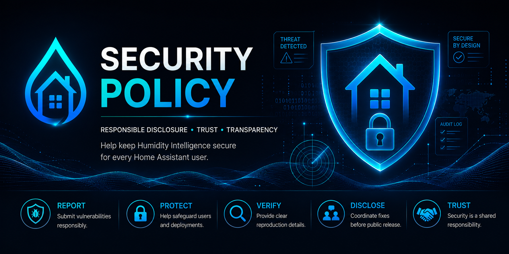

# Security Policy

## Responsible disclosure

Please do not open a public GitHub issue for security vulnerabilities or exposed secrets.

If you believe you have found a security issue, contact the maintainer privately first. If no dedicated security email is published for this repository yet, use the maintainer's GitHub profile to request a private disclosure channel.

## Sensitive information

Do not post sensitive Home Assistant or household information in issues, pull requests, screenshots, logs, YAML examples, or UI Gallery submissions. Sensitive information includes:

- Home Assistant tokens
- API keys
- Internal or external URLs
- Private entity IDs
- Home addresses or location details
- Device IDs and unique hardware identifiers
- Personal names or other personal data

## Reporting guidance

When reporting privately, include:

- A short description of the issue
- The affected Humidity Intelligence version
- The affected Home Assistant version, if relevant
- Steps to reproduce, with secrets redacted
- Any logs needed to understand the issue, with sensitive values removed

The maintainer will review the report and coordinate a fix or mitigation where appropriate.
