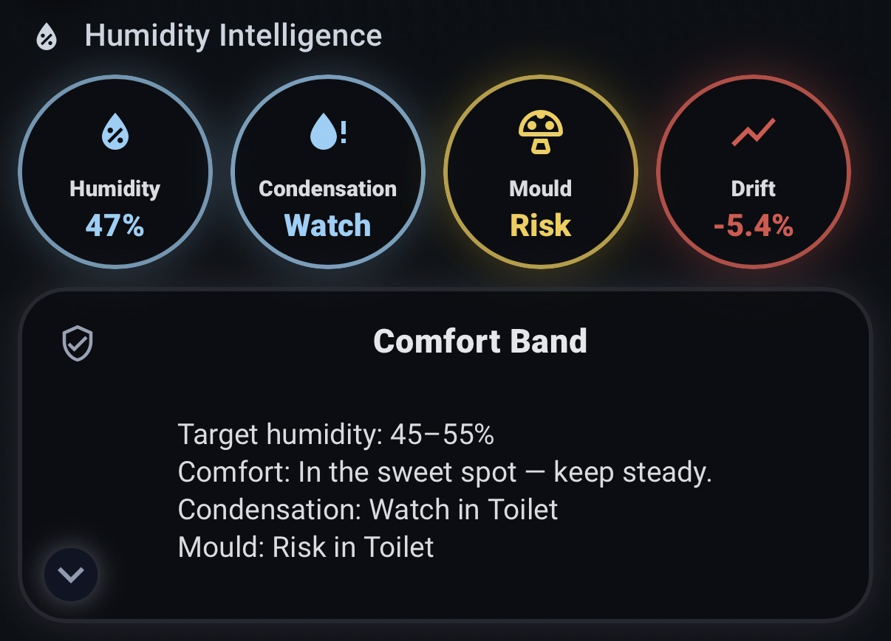

# Humidity Intelligence — Lovelace UI (Reference Card)

A **badge-first, responsive Lovelace UI** designed to visualise the **Humidity Intelligence** backend at a glance.

This card presents **actionable building insight**, not raw numbers — prioritising *risk*, *trend*, and *what to do next*.



---

## ✨ What this UI shows

This Lovelace card provides:

### 🔵 Top-row insight badges

Four circular, responsive badges showing:

* **House Humidity** — live average with danger awareness
* **Condensation Risk** — worst-room summary (`OK / Watch / Risk / Danger`)
* **Mould Risk** — worst-room summary
* **7-Day Drift** — rising or falling humidity trend

Badges adapt automatically for **mobile and tablet layouts**.

---

### 🟢 Comfort Band panel

A contextual summary panel showing:

* Current **target humidity band**
* Plain-language comfort guidance
* Worst-room condensation and mould call-outs

Includes a **chevron toggle** that controls the Constellation chart.

---

### 📈 Humidity Constellation (24h)

A collapsible **multi-room 24-hour humidity chart** showing:

* All mapped room humidity sensors
* Target comfort band overlay
* Clean, backend-driven data (no hard-coded logic)

The chart opens and closes using the canonical helper:

```
input_boolean.humidity_constellation_expanded
```

---

## 🧠 Design intent

This UI is intentionally:

* **Backend-driven** — no duplicated logic
* **Canonical-aware** — uses stable public entity IDs
* **Mobile-first** — scales cleanly to tablets
* **Non-prescriptive** — a reference, not a mandate

It demonstrates *how* the Humidity Intelligence data can be consumed — not *how it must look*.

---

## 📦 Requirements

### Backend

* **Humidity Intelligence** (v1.0.2+ supported, v1.1.x recommended)
* Public entity API intact (see below)

### Frontend (via HACS)

Required custom cards:

* `button-card`
* `apexcharts-card`
* `card-mod`

> ⚠️ The backend works without these.
> These are required **only** for this UI.

---

## 🚀 Installation

1. Ensure the **Humidity Intelligence backend** is installed and working.
2. Install required frontend cards via **HACS**.
3. Add a **Manual card** to your Lovelace dashboard.
4. Paste the YAML from this file.
5. Save.

If you keep the **public entity IDs unchanged**, the UI will work immediately.

---

## 🔧 Configuration notes

### Room series (Constellation chart)

The chart section references room humidity entities:

```yaml
sensor.living_room_humidity
sensor.kitchen_humidity
sensor.bedroom_humidity
```

These should match the entities you mapped in the **Humidity Intelligence Config**.

> Tip: aligning your entity IDs with the backend naming keeps dashboards portable.

---

### Do **not** rename these entities

This UI depends on the canonical public API:

```
sensor.house_average_humidity
sensor.house_humidity_drift_7d

sensor.worst_room_condensation
sensor.worst_room_condensation_risk
sensor.worst_room_mould
sensor.worst_room_mould_risk

binary_sensor.humidity_danger
binary_sensor.condensation_danger
binary_sensor.mould_danger

input_boolean.humidity_constellation_expanded
```

Treat these as **stable interfaces**, not internal implementation details.

---

## 🖼️ Gallery usage

This UI is suitable for inclusion in the **Humidity Intelligence UI Gallery**.

Recommended structure:

```text
/ui-gallery/<card-id>/
├── <card-id>_ui.png
├── <card-id>.yaml
└── README.md
```

See `CONTRIBUTING.md` for full gallery and PR requirements.

---

## 🧩 Compatibility

* ✔ Works with baseline and advanced Humidity Intelligence packages
* ✔ Mobile & tablet friendly
* ✔ No private entity leakage
* ✔ No backend modification

---

## 🙏 Attribution

Author: **@senyo888**

If you adapt or extend this UI, attribution is appreciated.

---

**This UI exists to answer one question quickly:**

> *Is my house comfortable, stable, or heading toward trouble — and where?*

If it helps you see that faster, it’s doing its job.

👉 [See the **UI Gallery** for default and community-built dashboards and cards.](/ui-gallery)
