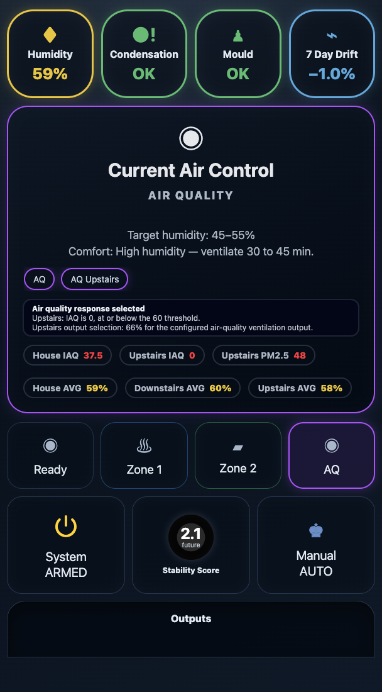

# Humidity Intelligence UI Gallery

Reusable Lovelace examples built on the Humidity Intelligence V2 generated card templates.

These examples are public documentation artifacts. They should demonstrate safe, canonical UI patterns without exposing private Home Assistant entity IDs, addresses, screenshots, or personal data.

The browseable UI Gallery lives in the GitHub Wiki:

- [UI Gallery](https://github.com/senyo888/humidity-intelligence/wiki/UI-Gallery)

This repository directory remains the canonical source for gallery YAML, preview assets, example notes, and contribution review. The Wiki is a visual navigation layer only; it must not define new entity semantics, backend behavior, lane priority, generated-card logic, or install guidance that differs from the repository.

## Available Layouts

### Default V2 Mobile AQ

- Style: mobile-first V2 control surface with air-quality lane active state
- Optimised for: phones and narrow dashboard panels
- Author: @senyo888
- Source template: `ui/cards/v2_mobile.yaml`
- Required custom cards: `card-mod`, `button-card`, `mod-card`, `apexcharts-card`

[](default-v2-mobile-aq/preview.png)

- [View preview](default-v2-mobile-aq/preview.png)
- [Card YAML](default-v2-mobile-aq/card.yaml)
- [Example notes](default-v2-mobile-aq/README.md)

### Default V2 Tablet Zone 2

- Style: tablet-friendly V2 control surface with Zone 2 active state
- Optimised for: tablets, wall panels, and wider dashboard views
- Author: @senyo888
- Source template: `ui/cards/v2_tablet.yaml`
- Required custom cards: `card-mod`, `button-card`, `mod-card`, `apexcharts-card`

[](default-v2-tablet-zone-2/preview.png)

- [View preview](default-v2-tablet-zone-2/preview.png)
- [Card YAML](default-v2-tablet-zone-2/card.yaml)
- [Example notes](default-v2-tablet-zone-2/README.md)

### Default V1 Mobile (Deprecated)

- Status: deprecated in v2.0.9; retained through the v2.0.9 line
- Replacement: Default V2 Mobile AQ / `ui/cards/v2_mobile.yaml`
- Style: legacy-compatible mobile layout with comfort band and humidity constellation
- Optimised for: phones and users keeping a V1-style dashboard presentation
- Author: @senyo888
- Source template: `ui/cards/v1_mobile.yaml`
- Required custom cards: `card-mod`, `button-card`, `mod-card`, `apexcharts-card`

[](default-v1-mobile/preview.png)

- [View preview](default-v1-mobile/preview.png)
- [Card YAML](default-v1-mobile/card.yaml)
- [Example notes](default-v1-mobile/README.md)

The V1 example remains available for existing users during v2.0.9, including the
dynamic-text HTML-escaping fix. Do not use it for new dashboard installations.
Removal is deferred to a separately approved v2.1 migration proposal.

## Submitting Gallery Examples

Read [CONTRIBUTING.md](CONTRIBUTING.md) before opening a UI Gallery pull request.

Every example must use:

```text
ui-gallery/<card-id>/
```

Required files:

- `README.md`
- `card.yaml` or `dashboard.yaml`
- `preview.png`

Use [reference.txt](reference.txt) as the entry template.
