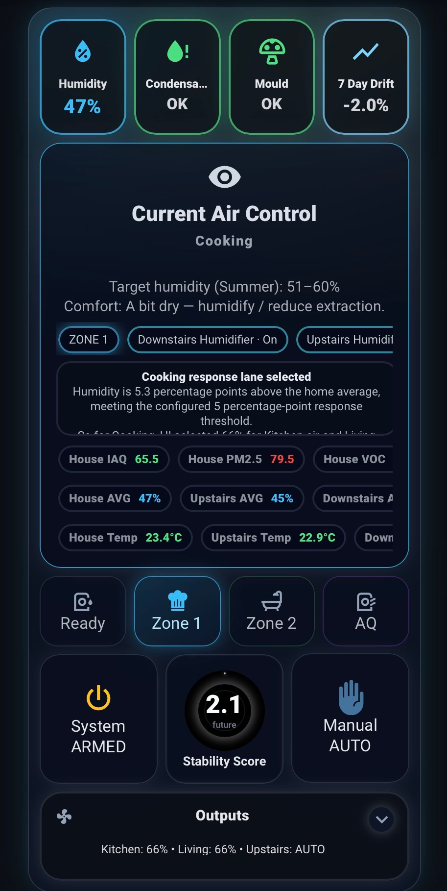

# Default V2 Tablet Zone 1 Cooking

- Style: tablet-friendly V2 control surface with the Zone 1 cooking lane selected
- Optimised for: tablets, wall panels, and wider dashboard views
- Author: @senyo888
- Source template: `custom_components/humidity_intelligence/ui/cards/v2_tablet.yaml`
- Required custom cards: `card-mod`, `button-card`, `mod-card`, `apexcharts-card`

## Notes

This example shows the default V2 tablet layout with the Zone 1 cooking response lane
selected. It highlights the larger badge presentation, backend-owned plain-language
Current Air Control reason panel, observed output summary, lane status controls, and
scan-friendly spacing intended for tablet and wall-panel use.

The YAML keeps ventilation and humidifier chips in one horizontally scrollable
Current Air Control row. The preview is a live `2.0.10-beta.7` capture taken after
restart, fresh export, complete Manual-card YAML replacement, and cache refresh. It
is package-and-card UI evidence, not soak or release-approval evidence.

The YAML is copied from the canonical generated card template and should be treated as an example artifact. In a real installation, prefer the card YAML exported by `humidity_intelligence.dump_cards` so placeholders match your generated entities.

## Files

- [Preview](preview.png)
- [Card YAML](card.yaml)
