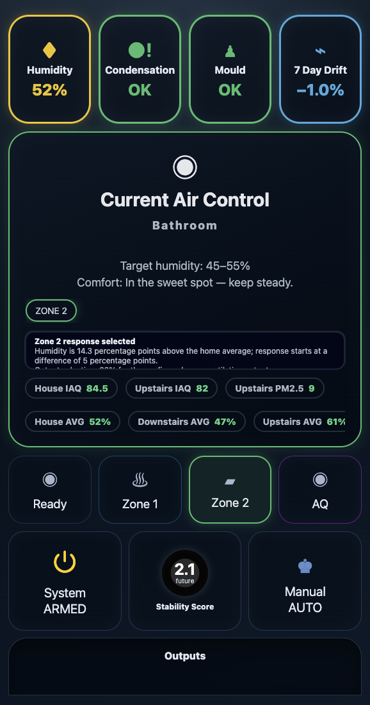

# Default V2 Tablet Zone 2

- Style: tablet-friendly V2 control surface with Zone 2 active state
- Optimised for: tablets, wall panels, and wider dashboard views
- Author: @senyo888
- Source template: `custom_components/humidity_intelligence/ui/cards/v2_tablet.yaml`
- Required custom cards: `card-mod`, `button-card`, `mod-card`, `apexcharts-card`

## Notes

This example shows the default V2 tablet layout with Zone 2 active. It highlights the
larger badge presentation, backend-owned plain-language Current Air Control reason panel,
lane status controls, and scan-friendly spacing intended for tablet and wall-panel
use.

The YAML keeps ventilation and humidifier chips in one horizontally scrollable
Current Air Control row. The preview predates beta.7 and is not beta.7 playback
evidence.

The YAML is copied from the canonical generated card template and should be treated as an example artifact. In a real installation, prefer the card YAML exported by `humidity_intelligence.dump_cards` so placeholders match your generated entities.

## Files

- [Preview](preview.png)
- [Card YAML](card.yaml)
