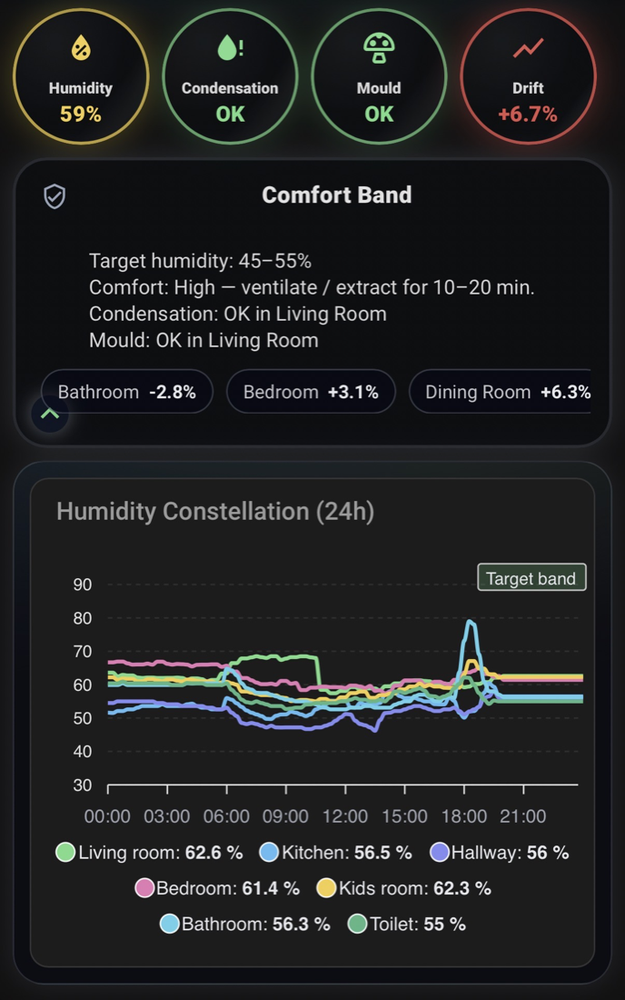

# Humidity Intelligence V2 UI

## Canonical Runtime Presentation Layer

---

## Purpose

The UI exists to render runtime truth.

It must:

- present active lane state
- show gate blocks
- display reason context
- reflect output stage
- mirror engine behavior

It does not:

- compute control logic
- infer lane priority


The engine governs.
The UI reflects.

---

## Included Layouts

- `cards/v2_mobile.yaml`
- `cards/v2_tablet.yaml`
- `cards/v1_mobile.yaml` (legacy-compatible skin)
- `cards/view_cards_button.yaml`

Mobile and tablet share identical control logic.

Difference:

- mobile: rounded top badges
- tablet: squared top badges

Feature parity is maintained.

---

## UI Preview

### v1 Mobile (Legacy-Compatible Skin)


### v2 Mobile (AQ State Example)


### v2 Tablet (Zone State Example)


---

## Deployment Workflow

### Step 1 - Complete Integration Setup First

Finish:

- telemetry
- zones
- humidifiers
- AQ
- alerts
- gates

The UI maps directly to your configuration, and HI notifies you where generated UI YAML is saved.

### Step 2 - Or Generate Cards via Services

Use:

- `humidity_intelligence.create_dashboard`
- `humidity_intelligence.view_cards`
- `humidity_intelligence.dump_cards`

Avoid manual YAML drift.

### Step 3 - After Any Option Change

When modifying:

- sensors
- zones
- alerts
- gates
- slope

Do:

1. save options
2. run `humidity_intelligence.refresh_ui`
3. regenerate cards if required
4. verify Current Air Control panel

Temperature chips:

- render only when `show_temperature_chips` is enabled
- colour against HI runtime comfort sensors
- use blue below band, green in band, yellow up to `1°C` above band, red above that
- show room slope chips only for configured temperature slope sources or provided slope sensors

Output details:

- render the expandable output details panel only when `show_output_entity_details` is enabled
- stay display-only; the option must not affect lane selection, output writes, isolation switches, or diagnostics
- require a fresh `humidity_intelligence.dump_cards` export after changing visibility

---

## Placeholder Mapping Model

`ui/register.py`:

1. builds placeholder to entity map
2. substitutes canonical templates
3. prunes optional rows
4. reports unresolved placeholders

Inventory files:

- `_sensor_ids.txt`
- `_binary_ids.txt`
- `_input_boolean_ids.txt`
- `_timer_ids.txt`

---

## Unresolved Placeholder

Occurs when:

- optional feature not configured
- telemetry missing
- template updated without mapping update

Impact:

- partial card degradation
- diagnostics report the issue

---

## Current Air Control Visual Contract

The panel must:

- match active lane
- reflect gate border color
- display correct chip state
- keep alert chipsets to the lane/status chip plus the resolved alert source/context chip only
- show readable reason text
- stay synced with real hardware behavior

If mismatch occurs:

- run `humidity_intelligence.refresh_ui`
- re-export cards
- check diagnostics

---

## v2.0.2 UI Contract Updates

- Humidity badge colors are now target-relative:
  - `below_target` = blue
  - `in_target` = green
  - `above_target` = yellow
  - `high_risk` = red
- Target humidity display now includes the active season/profile label (`Spring`, `Summer`, `Autumn`, `Winter`, or `Custom`).
- Reason window now includes expanded humidifier logic context from runtime telemetry (lane scope, trigger condition, thresholds, and recovery behavior).

## v2.0.4 UI Contract Updates

- Alert chipsets must not add redundant helper-switch chips after the resolved alert context.
- Chip rows expose a longer scroll reset delay marker (`15000ms`) so mobile/touch layouts are not aggressively snapped back while being read.
- Alert source chips should use `HI Active Alert Context`, backed by runtime alert telemetry, rather than inventing display-only context.

---

## Legacy v1 UI Support

`v1_mobile.yaml` remains compatible with the V2 engine.

It does not reintroduce:

- v1 backend templates
- v1 packages

Backend must be fully removed before using V2 runtime


```

---

## UI PR Checklist

- no stale placeholders
- no hardcoded alert counts
- canonical badge names preserved
- gate border sync maintained
- reason text remains readable

Humidity Intelligence V2 UI a structured runtime interface for a deterministic environmental engine.
